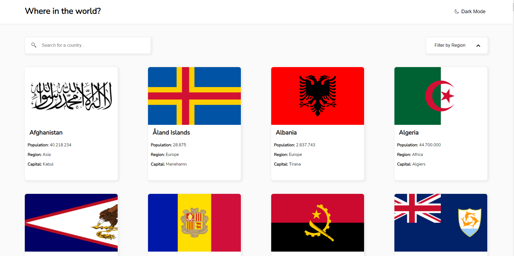
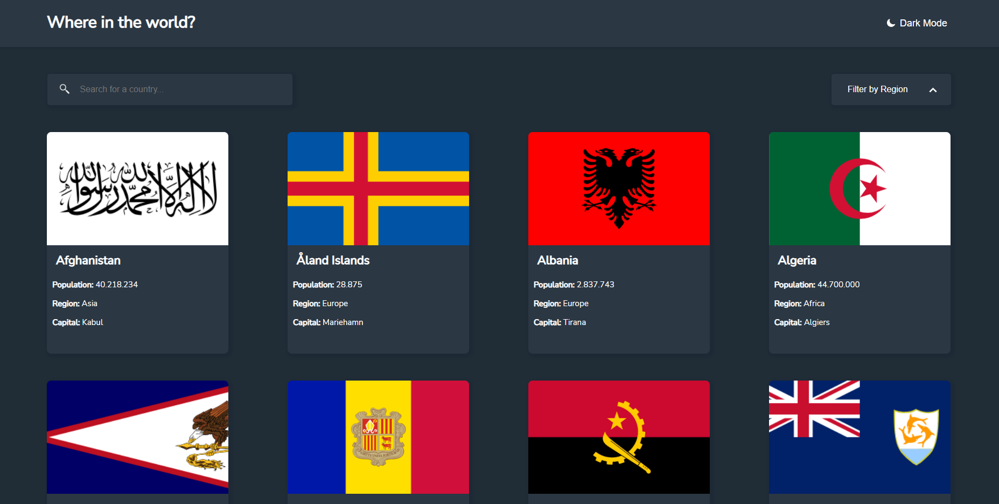
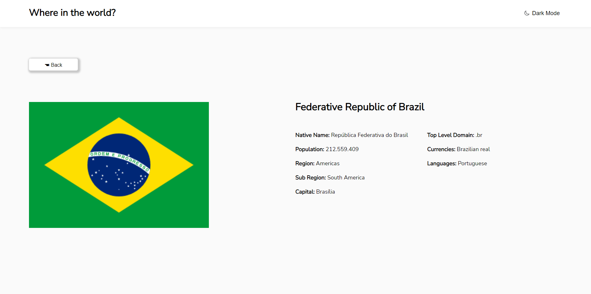
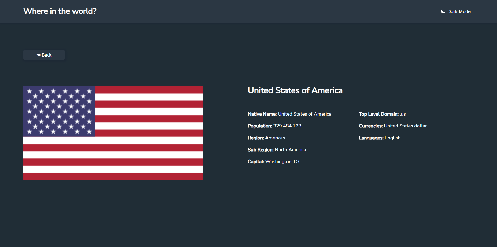
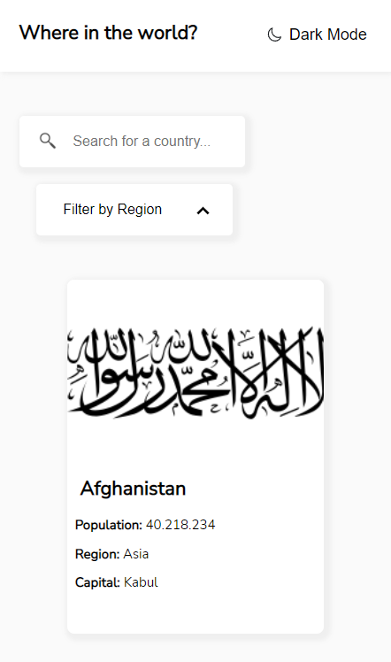
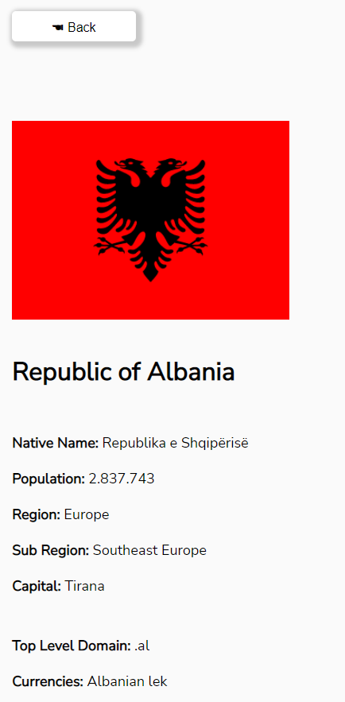

# Frontend Mentor - Rest Countries API

Esta é uma solução para o desafio [REST Countries API with color theme switcher](https://www.frontendmentor.io/challenges/rest-countries-api-with-color-theme-switcher-5cacc469fec04111f7b848ca) do site [Front End Mentor](https://www.frontendmentor.io/challenges), onde você escontra diversos desafios que vão te ajudar a melhorar o seu conhecimento no Front-End.

## Sumário

- [Resumo](#Resumo)
  - [Desafio](#Desafio)
  - [Screenshot](#screenshot)
  - [Link](#link)
- [Processo](#Processo)
  - [Construido com](#construido-com)
  - [O que eu aprendi](#o-que-eu-aprendi)
- [Autor](#autor)

## Resumo

O desafio é construir o projeto e deixá-lo o mais próximo possível do design oferecido. Podendo usar qualquer ferramenta para ajudar a concluir o desafio. Nesse desafio em específico é necessário fazer o uso de uma API externa chamada [Rest Countrie API](https://restcountries.com), onde você faz o requerimento dos dados dos países necessários


### Desafio

O objetivo desse site é que o usuário possa acessar informações de diversos países, tendo em vista o design mais fiel possível ao layout original e algumas funcionalidades como:

-Botão para trocar o tema de tela <br>
-Botão para filtragem <br>
-Barra de pesquisa <br>
-Design Responsivo <br>

### Screenshot

<p align="center"> Página inicial em White mode
    </img>
</p>

------
<p align="center"> Página inicial em Dark mode
    </img>
</p>

------
<p align="center"> Página Individual em White mode
    </img>
</p>

------
<p align="center"> Página Individual em Dark mode
    </img>
</p>

------
<p align="center"> Responsivo Página inicial
    </img>
</p>

------

<p align="center"> Responsivo Página Individual
    </img>
</p>

------

<p align="center"> Gif animado do site em funcionamento
    </img>
</p>

### Link: https://nicolasgabriiel.github.io/Countries/

## Processo

### Construido com

-HTML5 <br>
-CSS3 <br>
-JavaScript <br>
[-Rest Countrie API:](https://restcountries.com) <br>

### Principais coisas que aprendi

Mais funcionalidades do display Flex, como:

```css
    display: flex;
    flex-direction: row;
    flex-wrap: wrap;
    align-items: center;
    justify-content: space-between;
    align-items: stretch;
```


Utilizar o JS para barra de pesquisa:

```js
   filtroName.forEach( elemento => { 
        if (!elemento.textContent.includes(inputValido)) {
            elemento.parentNode.classList.add('desativado')
        } else {
            elemento.parentNode.classList.remove('desativado')
        }
    })
```

## Autor

-  Site pessoal - [Nicolas Gabriel](https://www.linkedin.com/in/nicolasgabriiel/)

  

